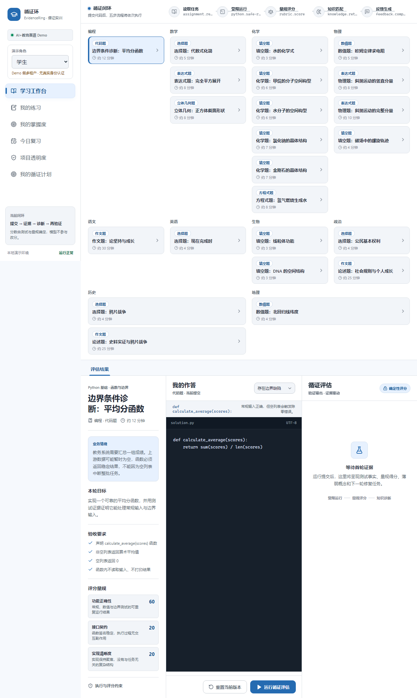
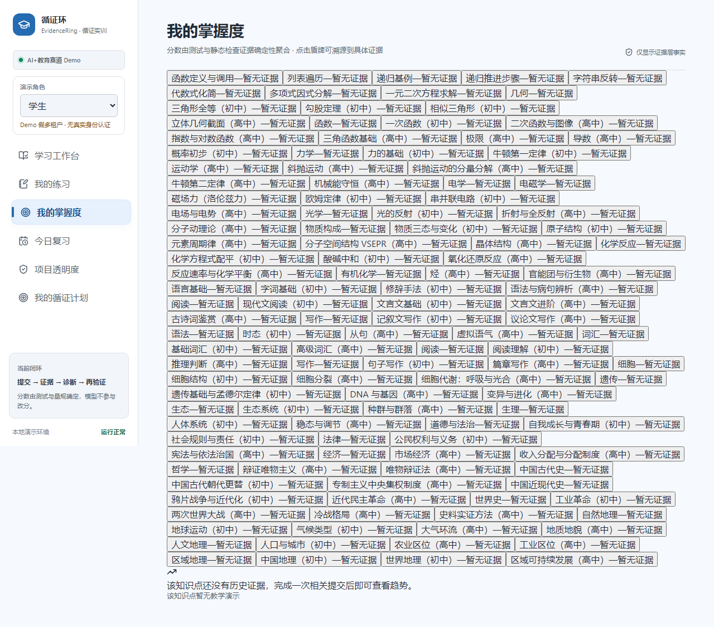
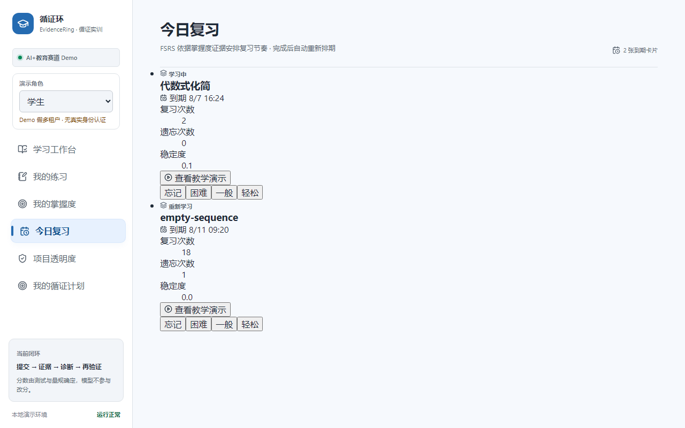
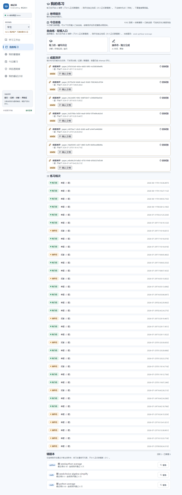
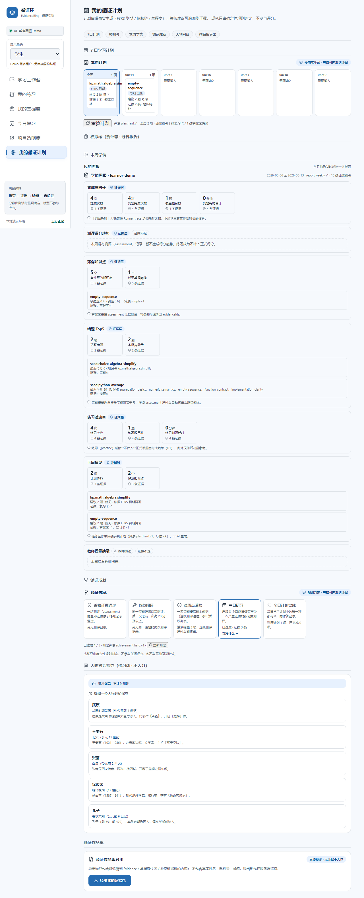
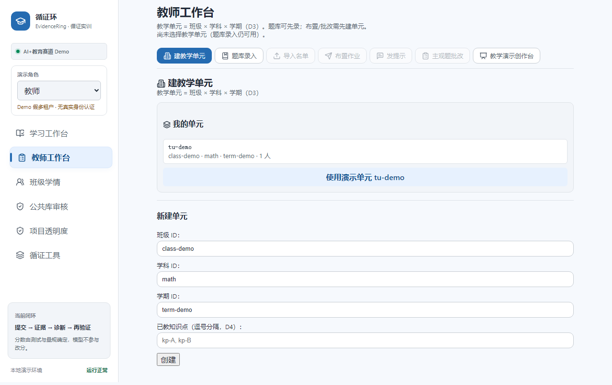
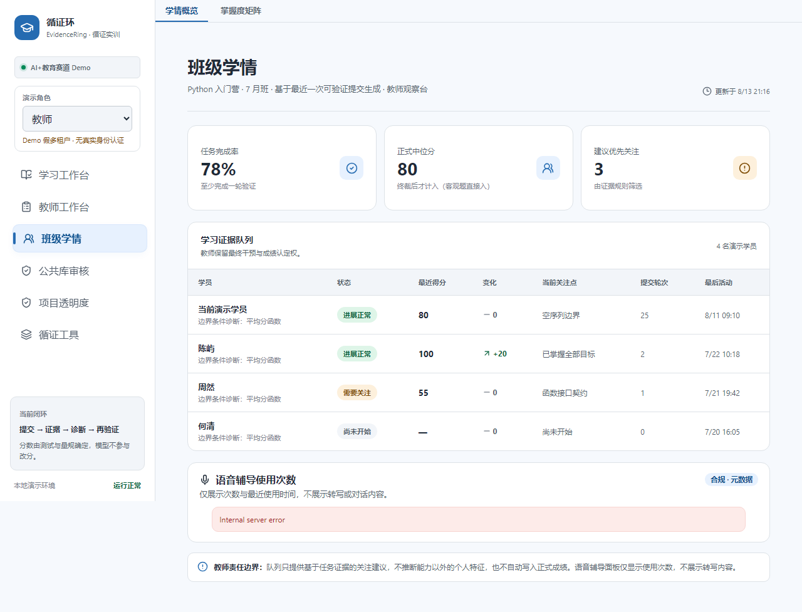
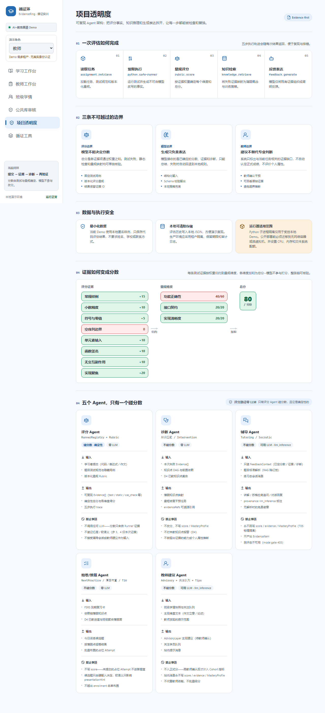
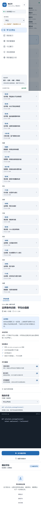
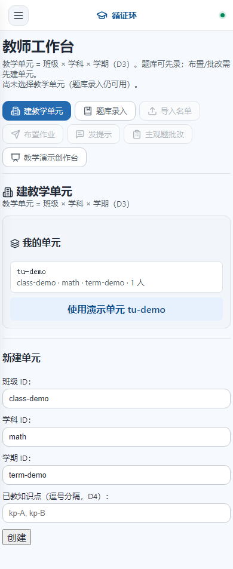

# 项目参数总览 · EvidenceRing

> 本文件是项目运行参数、配置、端口的单一事实源。改动配置时同步更新此处。

## 1. 基础

| 项 | 值 |
|---|---|
| 项目名 | evidence-ring |
| 版本 | 0.1.0 |
| License | Apache-2.0 |
| 类型 | AI+教育 · 循证实训 Agent（证据驱动评分） |
| 运行形态 | 单进程 Node HTTP + Vite SPA（dev 中间件 / prod 静态） |
| 模块系统 | ESM（`"type": "module"`） |
| Node 目标 | ES2022 |

## 2. 端口

| 端口 | 用途 | 来源 |
|---|---|---|
| **4180** | 应用主端口（dev + prod） | `server/index.ts` 默认 `process.env.PORT ?? 4180` |
| 4173 | `.env.example` 写的 PORT（**与默认不一致，以 4180 为准**） | `.env.example` |
| 4240 | E2E 测试端口 | `playwright.config.ts` `E2E_PORT ?? 4240` |
| 24679 | Vite HMR 端口（避开默认 24678 冲突） | `server/index.ts` `VITE_HMR_PORT ?? 24679` |

> **已知不一致**：`.env.example` 写 `PORT=4173`，但代码默认 4180。统一为 4180（或显式设 PORT）。

## 3. 环境变量

### 核心（`.env.example`）

| 变量 | 默认 | 说明 |
|---|---|---|
| `LLM_API_KEY` | 空 | LLM 反馈生成（未设 → 本地策略 fallback） |
| `LLM_BASE_URL` | `https://api.openai.com/v1` | OpenAI 兼容端点 |
| `LLM_MODEL` | `gpt-4.1-mini` | 模型名 |
| `PORT` | 4180 | HTTP 端口 |
| `AUDIT_HMAC_SECRET` | `change-me-...` | 审计 HMAC 签名密钥（生产必设，缺失 fail-fast） |
| `MULTIMODAL_ENABLED` | `false` | 多模态 feature flag（红线，ADR-0005） |
| `VITE_MULTIMODAL_ENABLED` | `false` | 前端多模态 flag |
| `STT_PROVIDER` | `webspeech` | 语音识别 provider |
| `VITE_HMR_PORT` | 24679 | Vite HMR 端口 |

### Python 运行器

| 变量 | 默认 | 说明 |
|---|---|---|
| `PYTHON_RUNNER` | `subprocess` | `subprocess` \| `docker`（ADR-0002） |
| `PYTHON_BIN` | `python` | Python 可执行 |
| `PYTHON_RUNNER_TIMEOUT_MS` | 1500 | 执行超时 |

### Docker 运行器（`PYTHON_RUNNER=docker`）

| 变量 | 默认 | 说明 |
|---|---|---|
| `DOCKER_BIN` | `docker` | docker 可执行 |
| `DOCKER_RUNNER_IMAGE` | `python:3.12-slim` | 容器镜像 |
| `DOCKER_RUNNER_POOL_SIZE` | 2 | 容器池大小 |
| `DOCKER_RUNNER_TIMEOUT_MS` | 1500 | 执行超时 |
| `DOCKER_RUNNER_STARTUP_TIMEOUT_MS` | 15000 | 启动超时 |
| `DOCKER_RUNNER_MEMORY` | 128m | 内存限制 |
| `DOCKER_RUNNER_MEMORY_SWAP` | 128m | swap 限制 |
| `DOCKER_RUNNER_CPUS` | 0.5 | CPU 限制 |
| `DOCKER_RUNNER_TMPFS` | `/tmp:noexec,nosuid,size=100m` | tmpfs 挂载 |
| `DOCKER_RUNNER_USER` | `65532:65532` | 非 root 用户 |
| `DOCKER_RUNNER_PIDS_LIMIT` | 64 | PID 限制 |

### 生产预算（`.env.production.example`）

| 变量 | 默认 | 说明 |
|---|---|---|
| `DEMO_BUDGET_MAX_NODES` | 4000 | 场景节点上限 |
| `DEMO_BUDGET_MAX_TRIANGLES` | 500000 | 三角面上限 |
| `DEMO_BUDGET_MAX_TEXTURE_PIXELS` | 16777216 | 纹理像素上限 |
| `DEMO_BUDGET_MAX_ANIMATION_SECONDS` | 600 | 动画时长上限 |
| `DEMO_BUDGET_MAX_MEDIA_REFS` | 200 | 媒体引用上限 |
| `MEDIA_LIMIT_IMAGE_BYTES` | 25 MiB | 图片上限 |
| `MEDIA_LIMIT_GLB_BYTES` | 300 MiB | GLB 上限 |
| `MEDIA_LIMIT_VIDEO_BYTES` | 2 GiB | 视频上限 |
| `MEDIA_LIMIT_VTT_BYTES` | 2 MiB | VTT 上限 |
| `MEDIA_LIMIT_AUDIO_BYTES` | 250 MiB | 音频上限 |
| `MEDIA_QUOTA_TEACHER_BYTES` | 10 GiB | 教师媒体配额 |

## 4. npm scripts

| 命令 | 说明 |
|---|---|
| `npm run dev` | 开发（tsx watch + Vite 中间件） |
| `npm run dev:no-watch` | 非监听模式（E2E 用） |
| `npm run build` | `tsc --noEmit && vite build` |
| `npm run preview` | 生产预览（`--production`） |
| `npm test` | vitest run（全量单测） |
| `npm run test:watch` | vitest watch |
| `npm run test:e2e` | playwright test（3 浏览器） |
| `npm run lint` | eslint `--max-warnings 0` |
| `npm run check` | lint + test + build + 预算验证 + e2e（完整门） |
| `npm run db:generate` | drizzle-kit 生成迁移 |
| `npm run db:studio` | drizzle-kit studio |
| `npm run reproduce` | 复现脚本 |
| `npm run accept:docker` | Docker daemon 验收 |

## 5. 数据存储

| 路径 | 用途 |
|---|---|
| `.data/product.sqlite` | 主产品库（questions / auth / org / attempts / media / demonstration） |
| `.data/audit.sqlite` | 审计日志（哈希链 + HMAC，ADR-0003） |
| `data/` | 媒体 blob（FsBlobStore，按内容哈希） |
| `.data/evaluations.json` | 遗留 JSON 评估（启动时自动迁移到 SQLite） |
| `data/knowledge-points.seed.json` | 知识点 DAG seed（121 kp） |

### SQLite 迁移（`server/db/migrations/`）

| 编号 | 内容 |
|---|---|
| 0001 | memory_layer（mastery + review） |
| 0002 | product_org（teaching_units / enrollments） |
| 0003 | auth + question_bank |
| 0004 | question_solution（T09） |
| 0005 | import_drafts |
| 0006 | teacher_tips（T14） |
| 0008-0010 | demonstration_module / publication / notifications |
| 0011 | visualization_migration_map |
| 0012-0015 | material_import / study_plan / mock_exam / weekly_report |
| 0016-0020 | achievements / persona_dialogue / flashcard / portfolio / attempt_paper |

## 6. 题型 × 学科

### QuestionType（7 引擎 + geometry）

| 类型 | Runner | 说明 |
|---|---|---|
| `choice` | ObjectiveValidator | 选择题 |
| `fill_blank` | ObjectiveValidator | 填空 |
| `numeric` | ObjectiveValidator | 数值容差 |
| `expression` | ExpressionValidator（CAS） | 数学/物理表达式 |
| `chem_equation` | ChemEquationValidator | 化学方程式配平 |
| `code` | PythonSubprocess/DockerRunner | 代码测试 |
| `essay` | EssayRunner | 作文/论述（客观 linter + 主观 advisory） |
| `geometry` | GeometryRunner | 立体几何截面（ADR-0010） |

### 学科（9 门）

math / physics / chemistry / chinese / english / biology / politics / history / geography

### EvidenceKind

`test_case` / `static_check` / `cas_check` / `answer_match` / `lint_result` / `structural_metric` / `render_artifact`

## 7. 角色与权限

| 角色 | 来源 | 权限 |
|---|---|---|
| `student` | DemoRole / ProductRole | 自己的数据（studentId 隔离） |
| `teacher` | DemoRole / ProductRole | 教学单元内（teacherId 隔离） |
| `admin` | DemoRole | 全量教学数据 |
| `PublicLibraryReviewer` | `public_library_reviewer` flag | 仅公共库审核（隔离教学/成绩数据，spec §2.8） |

### 权限门（`server/auth/authorization.ts`）

- `authorizeAccess`: teaching（教师/admin）| student-data（自己或教师）
- `authorizeStudentInUnit`: 三道门（角色 → 单元归属 → enrollment）
- `guardRoute`: 深模块（authorize→denied-audit→403 藏一处）

## 8. 技术栈

### 运行时
- Node.js（ES2022, ESM）
- better-sqlite3（WAL + 哈希链审计）
- Docker（可选，`PYTHON_RUNNER=docker`，`--network=none` + 资源限制）

### 前端
- React 19 + Vite 6
- Three.js / @react-three/fiber / drei（3D 可视化，ADR-0013）
- PlayCanvas（专业 3D 创作，ADR-0015）
- KaTeX（数学渲染）
- lucide-react（图标）

### 评分
- mathjs（CAS，表达式等价）
- ts-fsrs（间隔复习调度）
- zod（LLM 信任边界）

### 工具
- tsx（TS 执行）
- vitest 3（单测，1412 tests）
- Playwright 1.54（E2E，3 浏览器）
- ESLint 9 + typescript-eslint
- drizzle-kit（迁移生成）

## 9. 架构铁律（ADR-0001）

1. **分数只来自 Runner 产出的 Evidence**——LLM 不得改分或捏造事实
2. **按题型切分评分，不按学科**（ADR-0008）
3. **双聚合根隔离**：MasteryProfile（硬事实）∥ LearnerNarrative（软语义）不可交叉写入（ADR-0006）
4. **Provenance 必填**：`evidence` / `llm_inference` / `learner_self_report` / `teacher_annotation`
5. **多模态 feature flag 红线**：`MULTIMODAL_ENABLED` 一键关，主评分闭环不因语音回归（ADR-0005）
6. **评分路径零耦合演示模块**：架构测试守护（`tests/architecture.test.ts`）

## 10. 文档地图

### 顶层
- `README.md` — 入口
- `CONTEXT.md` — 域语言 + 治理 + 边界（单一事实源）
- `DESIGN.md` — 设计系统（调色板/字体/组件/规则）
- `PRODUCT.md` — 产品定位
- `HANDOFF.md` — 交接

### ADR（`docs/adr/`，17 篇）
0001 证据优先评分 · 0002 容器隔离 · 0003 Demo 合规 · 0004 多学科证据 · 0005 多模态 · 0006 Provenance · 0007 记忆层选型 · 0008 题型切分 · 0009-0012 学科切片 · 0013 统一可视化 · 0014 晶体 3D · 0015 教师 AI 可视化 · **0016 架构深化** · **0017 圆桌动线**

### 产品路线（`docs/product-roadmap/`）
- `PRODUCT-MAP.md` — T01-T23 状态
- `decisions/T01-T23` — 决策票
- `prds/T15-T23` — PRD
- `reports/T01-T23` — 实施报告
- `issues/ISSUE-T15-T23` — tracer-bullet tickets

### 演示与部署（`docs/`）
- `ARCHITECTURE.md` / `COMPLIANCE.md` / `DEPLOYMENT.md`
- `DEMO-*.md` — 现场 SOP / 问答库 / 弱网演练 / cue card
- `PRD.md` / `PROJECT_BRIEF.md` / `QUALITY_REVIEW.md`
- `research/` — 竞品/OCR/LLM/Mem0/媒体管线研究
- `spec/teaching-demonstration-module-spec.md`

## 11. 验证基线

| 检查 | 命令 | 当前状态 |
|---|---|---|
| 类型 | `npx tsc --noEmit` | 0 error |
| Lint | `npm run lint` | 0 error / 0 warning |
| 单测 | `npm test` | 1406 passed / 6 docker-skipped |
| E2E | `npm run test:e2e` | 17-18 passed（WebGL flaky） |
| 构建 | `npm run build` | ✓ |
| 完整门 | `npm run check` | lint + test + build + 预算 + e2e |

## 12. 目录结构

```
evidence-loop/
├── server/              # 后端（HTTP + 领域 + store + runner）
│   ├── http/            # guardRoute + httpUtils（传输层）
│   ├── domain/          # EvaluationAgent + evaluationRoutes
│   ├── data/            # assignmentRoutes + cohortRoutes + knowledgeRoutes
│   ├── audit/           # AuditStore + auditRoutes
│   ├── mastery/         # MasteryService + masteryRoutes
│   ├── review/          # ReviewScheduler + reviewRoutes
│   ├── multimodal/      # multimodalRoutes + askRoute + sttRoute
│   ├── runner/          # 7 题型 Runner + RunnerRegistry
│   ├── questionbank/    # QuestionBankService + QuestionStore + routes
│   ├── teacher/         # T08 教师工作流
│   ├── student/         # T07 学生刷题
│   ├── demonstration/   # 教学演示模块（票 06-14）
│   ├── store/           # AttemptStore + SqliteAttemptStore
│   ├── serverContext.ts # 组合根
│   └── index.ts         # 纯路由 dispatcher
├── shared/
│   ├── contracts.ts     # barrel re-export
│   └── contracts/       # 11 bounded context 子模块（C3）
├── src/
│   ├── App.tsx          # 视图 dispatcher + hash router
│   ├── components/      # RoleGate + Banner + CohortShell + ...
│   ├── lib/             # api + useHashRoute + demoRole
│   └── styles.css       # DESIGN.md token 实现
├── tests/               # vitest 单测
├── e2e/                 # playwright
├── docs/                # 文档（见 §10）
├── scripts/             # split-contracts / verify-build-budget / reproduce
├── docker/python-runner/# Docker runner 镜像
└── data/                # 媒体 blob + seed
```

## 13. 页面截图

> 截图由 `scripts/capture-screenshots.mjs` 自动捕获（`npm run dev:no-watch` 后运行）。

### 学生端

| 截图 | 页面 | 说明 |
|---|---|---|
|  | 学习工作台 | 五步闭环条 + 提交面板（默认落地页） |
|  | 我的掌握度 | 热力图 + 趋势 + 干预卡（P0 闭环） |
|  | 今日复习 | FSRS 到期队列 |
|  | 我的练习 | 今日该练 + 双模卡片（P1） |
|  | 我的循证计划 | 7 日计划 + 模拟考 + 周报 + 成就 |

### 教师端

| 截图 | 页面 | 说明 |
|---|---|---|
|  | 教师工作台 | 单元 → 题库 → 名单 → 布置 → 批改 |
|  | 班级学情 | 概览 + 掌握度矩阵（P1 合并） |
|  | 项目透明度 | Agent 名册 + 证据流 |

### 移动端

| 截图 | 页面 | 说明 |
|---|---|---|
|  | 侧栏抽屉 | 响应式 ≤980px |
|  | 教师工作台 | 移动端适配 |

### 演示视频片段

现有素材在 `docs/screenshots/demo-videos/`：开场反差（code/fallback/math）+ 实录（evidence/fallback/math/teacher/tutoring）。

### 截图脚本

```bash
# 1. 起服务
npm run dev:no-watch &
# 2. 截图（需 playwright 已装）
node scripts/capture-screenshots.mjs
# 输出到 docs/screenshots/pages/*.png
```
